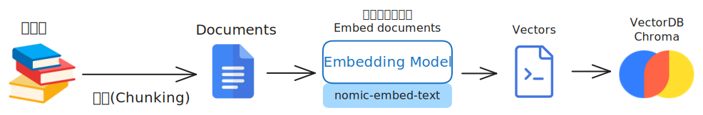
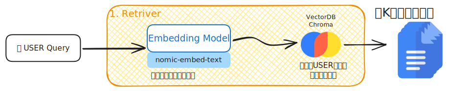
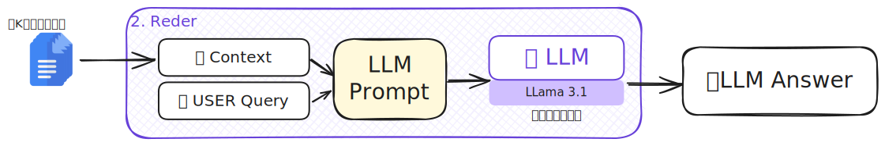

# RAG 超簡易教學-圖文並茂
## 架構圖




## 開啟方式
1. 下載模型(需要先安裝ollama)
   ```bash
   ollama pull nomic-embed-text
   ollama run llama3.1
   ```
2. 創建conda環境並且進入環境
   ```bash
   conda create -n RAG python==3.10
   conda activate RAG
   ```
3. 安裝依賴庫
   ```bash
   pip install -r requirements.txt
   ```
4. 開啟`mian.ipynb`
